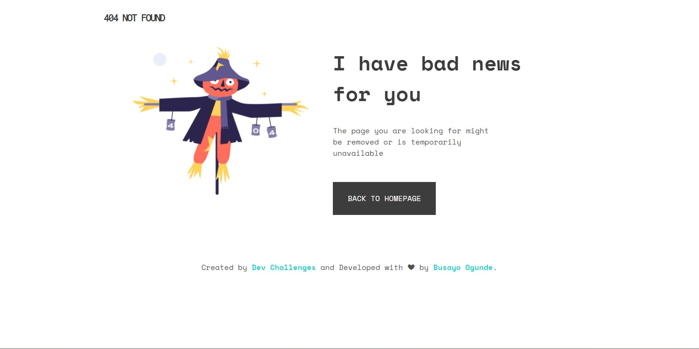

<!-- Please update value in the {}  -->

<h1 align="center">{Error- 404 NOT FOUND}</h1>

   Solution for a challenge from  <a href="http://devchallenges.io" target="_blank">Devchallenges.io</a>.

  <h3>
    <a href="https://error-404notfound.netlify.app">
      Demo
    </a>
     | 
    <a href="https://codepen.io/Hashirama-Senju/pen/GRMNwqB">
      Solution
    </a>
     | 
    <a href="https://devchallenges.io/challenges/wBunSb7FPrIepJZAg0sY">
      Challenge
    </a>
  </h3>

## Overview

Introduce your projects by taking a screenshot or a gif. Try to tell visitors a story about your project by answering:

- https://error-404notfound.netlify.app
- I had a good experience building this.
- I was able to relearn CSS properties i had forgotten.

### Built With

- # HTML5
- # CSS3
- # CSS FLEXBOX

## Features

This application/site was created as a submission to a [DevChallenges](https://devchallenges.io/challenges) challenge. The [challenge](https://devchallenges.io/challenges/wBunSb7FPrIepJZAg0sY) was to build an application to complete the given user stories.

## Contact

- Website [hokagecodes](https://hokagecodes.netlify.app)
- GitHub [hokageCodes](https://{github.com/hokageCodes})
- Twitter [busaryoh](https://{twitter.com/busaryoh})
