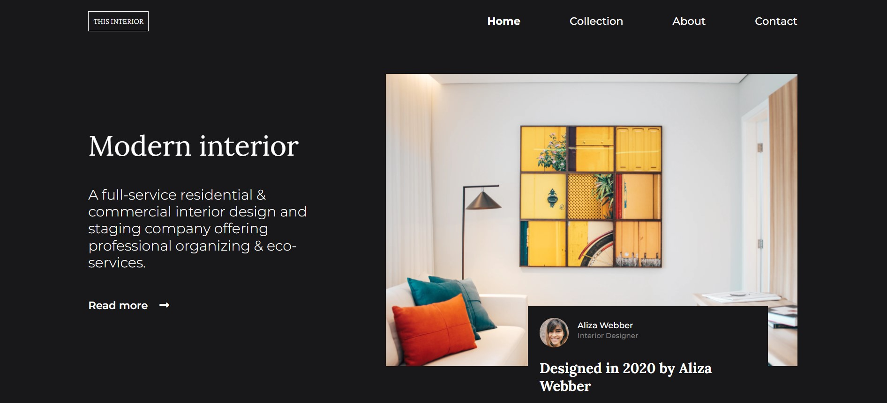

<!-- Please update value in the {}  -->

<h1 align="center">{Interior Decoration}</h1>

   Solution for a challenge from  <a href="http://devchallenges.io" target="_blank">Devchallenges.io</a>.

  <h3>
    <a href="https://festive-raman-82cb41.netlify.app">
      Demo
    </a>
     | 
    <a href="https://github.com/hokageCodes">
      Solution
    </a>
     | 
    <a href="https://devchallenges.io/challenges/Jymh2b2FyebRTUljkNcb">
      Challenge
    </a>
  </h3>

## Overview

- Check Demo at https://festive-raman-82cb41.netlify.app/

### Built With

<!-- This section should list any major frameworks that you built your project using. Here are a few examples.-->

- [HTML]
- [CSS]
- [Figma Design]

## Features

<!-- List the features of your application or follow the template. Don't share the figma file here :) -->

This application/site was created as a submission to a [DevChallenges](https://devchallenges.io/challenges) challenge. The [challenge](https://devchallenges.io/challenges/Jymh2b2FyebRTUljkNcb) was to build an application to complete the given user stories.

## Acknowledgements

## Contact

- GitHub [hokageCodes](https://{github.com/hokagecodes})
- Twitter [busaryoh](https://{twitter.com/busaryoh})
