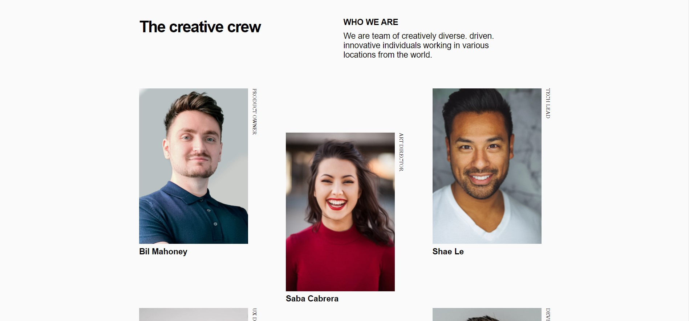

<!-- Please update value in the {}  -->

<h1 align="center">{My Team Page}</h1>

   Solution for a challenge from  <a href="http://devchallenges.io" target="_blank">Devchallenges.io</a>.

  <h3>
    <a href="https://my-teamwon.netlify.app/">
      Demo
    </a>
     | 
    <a href="https://codepen.io/Hashirama-Senju/pen/XWepXVq">
      Solution
    </a>
     | 
    <a href="https://devchallenges.io/challenges/hhmesazsqgKXrTkYkt0U">
      Challenge
    </a>
  </h3>

<!-- OVERVIEW -->

## Overview

Introduce your projects by taking a screenshot or a gif. Try to tell visitors a story about your project by answering:

- https://my-teamwon.netlify.app/
- I learnt more about CSS GRID i forgot
- CSS GRID

### Built With

<!-- This section should list any major frameworks that you built your project using. Here are a few examples.-->

- [HTML](HTML5)
- [CSS3](CSS3)
- [CSS GRID](CSS GRID)

## Features

<!-- List the features of your application or follow the template. Don't share the figma file here :) -->

This application/site was created as a submission to a [DevChallenges](https://devchallenges.io/challenges) challenge. The [challenge](https://devchallenges.io/challenges/hhmesazsqgKXrTkYkt0U) was to build an application to complete the given user stories.

## Contact

- Website [Team page](https://my-teamwon.netlify.app/)
- GitHub [hokageCodes](https://{github.com/kagedevio})
- Twitter [busaryoh](https://{twitter.com/busaryoh})
