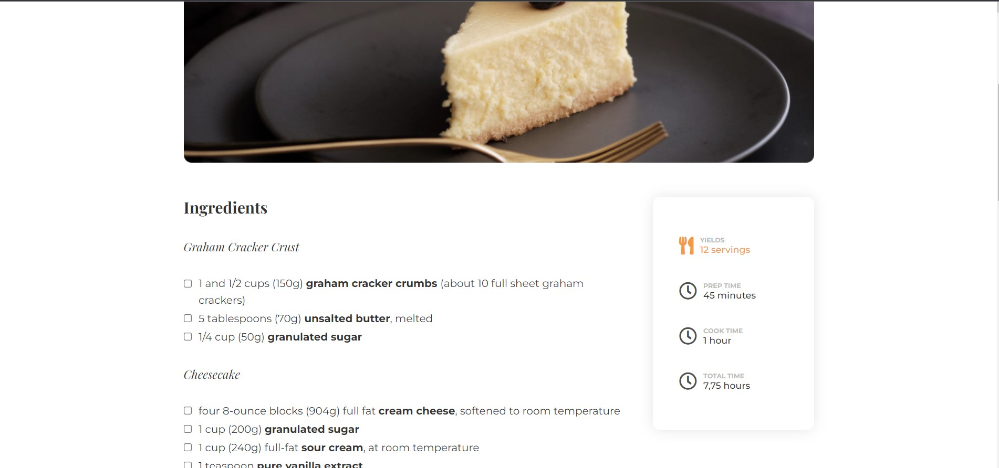

<!-- Please update value in the {}  -->

<h1 align="center">RECIPE PAGE</h1>

   Solution for a challenge from  <a href="http://devchallenges.io" target="_blank">Devchallenges.io</a>.

  <h3>
    <a href="https://eloquent-mcnulty-6c0379.netlify.app/">
      Demo
    </a>
     | 
    <a href="https://github.com/hokageCodes">
      Solution
    </a>
     | 
    <a href="https://devchallenges.io/challenges">
      Challenge
    </a>
  </h3>

<!-- OVERVIEW -->

## Overview

Introduce your projects by taking a screenshot or a gif. Try to tell visitors a story about your project by answering:

- Where can I see your demo?
- What was your experience?
- What have you learned/improved?
- Your wisdom? :)

### Built With

<!-- This section should list any major frameworks that you built your project using. Here are a few examples.-->

- HTML
- CSS

## Contact

- Website [Demo](https://eloquent-mcnulty-6c0379.netlify.app/)
- GitHub [github](https://{github.com/hokageCodes})
- Twitter [twitter](https://{twitter.com/your-busaryoh})
